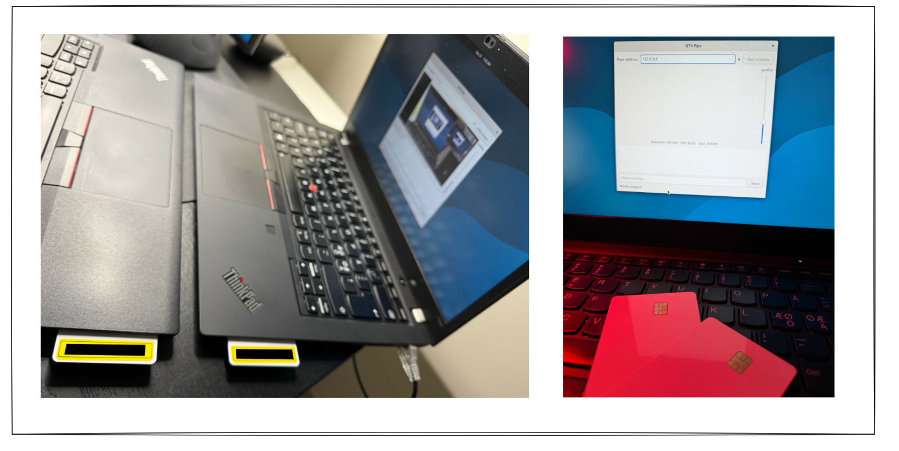

# hsmproxy



This training project explores modular design, simplicity, and minimal
dependencies. It demonstrates how a seemingly insecure application such as
gtk-pipe can gain authenticated, encrypted communication over the network
through a separate security proxy.

The physical form factor of HSM smartcards is central to the project. By
keeping long-term private identity keys on the cards, they provide a hardware
root of trust for peer authentication—the foundation for session secrecy.
Ephemeral key exchange and software encryption protect traffic on the wire.

C11 proof-of-concept proxy carrying gtk-pipe's video, audio, and text UDP
channels through one mutually authenticated, encrypted UDP tunnel.
SmartCard-HSM identity uses OpenSC PKCS#11 over Linux PC/SC; OpenSSL performs
X25519, HKDF-SHA-256, and ChaCha20-Poly1305 session encryption.

The operator reports successful two-host SmartCard-HSM diagnostics and stable
operation with gtk-pipe. Diagnostics covered all three channels, rekey from
either host, and card-removal/restart recovery. See [TESTING.md](TESTING.md)
for the test record and remaining coverage. This is a custom proof-of-concept
protocol, not a production-reviewed security transport.

## Questions

* What risks are managed with this kind of implementation ?
* Are there any risks still remaining ?
* Risks, are they development, usage or underlying science ? 
* What would make this restricted implementation ? 

## Build and test on Debian 13

```sh
sudo apt update
sudo apt install build-essential pkg-config libssl-dev libpcsclite-dev \
  libp11-kit-dev pcscd libccid opensc pcsc-tools python3
sudo systemctl enable --now pcscd.socket
make
make check
make sanitize
```

`make check` needs permission to open loopback UDP sockets. The sanitizer target
requires an environment where AddressSanitizer/LeakSanitizer can inspect the
process. Tests generate disposable software signing keys and a mock PKCS#11
module exclusively under the test harness. The installed daemon has no
software-identity mode or plaintext fallback.

Only `hsmproxy` is installed by `make install` (default `/usr/local/bin`, honors
`PREFIX` and `DESTDIR`). GTK and GStreamer are not proxy build dependencies.

## Prepare identities and configuration

For fresh cards, PIN recovery, and destructive reinitialization, follow
[card-init.md](card-init.md). It explains why the SO-PIN must be recorded and
protected before the first initialization.

Provision one hardware-generated P-256 signing key per SmartCard-HSM externally.
The daemon never initializes a card, creates/imports keys, or changes a PIN.
It requires the key's sensitive/nonextractable provenance attributes and
rejects keys requiring per-operation PIN authentication in this first version.

Read-only inventory tools:

```sh
opensc-tool --list-readers
pkcs11-tool --module /usr/lib/x86_64-linux-gnu/opensc-pkcs11.so --list-slots
pkcs11-tool --module /usr/lib/x86_64-linux-gnu/opensc-pkcs11.so --list-mechanisms
```

Use the exact PC/SC reader name and token serial, and the provisioned key's
hexadecimal `CKA_ID`. V1 requires reader names of at most 64 bytes and an exact
match to OpenSC's padded slot description. Ambiguous readers/tokens are rejected.
The module must use OpenSC's PC/SC backend.

Provide the matching local PEM certificate or public key, and the peer's PEM
public key/certificate. No private key file is accepted for daemon signing.
If your public certificate is DER, convert it before configuring the daemon:

```sh
openssl x509 -inform DER -in site-a.der -out site-a.crt
./hsmproxy --fingerprint site-a.crt
```

Exchange and verify the printed 64-digit SHA-256 SPKI pins over a trusted
channel. Do not accept a fingerprint merely because it arrived with an
untrusted certificate. V1 uses explicit key pinning; it does not validate a
CA chain, certificate hostname, expiry, or revocation.

Copy [examples/site-a.ini](examples/site-a.ini) and
[examples/site-b.ini](examples/site-b.ini), replacing the paths, serial/reader,
key ID, peer pin, and physical IP addresses. The examples deliberately contain
invalid pin placeholders. Keep exactly one initiator and one responder.
All settings are mandatory; unknown or duplicate settings are errors.

```sh
./hsmproxy --check-config /path/to/site-a.ini
./hsmproxy --config /path/to/site-a.ini
```

The first command checks syntax and public-key pins without touching the card.
The second prompts securely for the PIN. For supervised use, `--pin-fd N` reads
one line (at most 126 bytes) from an already-open protected descriptor; pass the
credential through that descriptor, not through argv or an environment variable.
A wrong PIN is attempted once. PIN bytes are erased after login.

## Test two hosts without gtk-pipe

After provisioning both cards and completing the normal peer configurations,
run these commands on the corresponding hosts:

```sh
# Host A (initiator)
./hsmproxy --config /path/to/site-a.ini --test-channels
```

```sh
# Host B (responder)
./hsmproxy --config /path/to/site-b.ini --test-channels
```

Enter each card's user PIN normally. Keep gtk-pipe stopped: this mode binds
its application endpoints, `127.0.0.1:5000/5002/5004` (or your configured ports).
A port collision is a startup error. No second test program is needed.

The ordinary pinned, HSM-authenticated handshake exchanges fresh ephemeral keys
and derives the session keys. Test mode does not enroll identity keys or learn
peer pins: the provisioning and public-key exchange in [card-init.md](card-init.md)
still come first. The HSM and fail-closed checks remain active throughout.

Each channel exercises the full path in both directions:

```text
built-in tester A → localhost UDP → proxy A → encrypted tunnel → proxy B
                                                              ↓ localhost UDP
                                                        built-in tester B
                 ← same path back with a checked echo ←
```

Both hosts send one probe per channel per second, cycling through 64 bytes,
256 bytes (limited by the negotiated maximum), and the negotiated maximum.
Replies must match the original random challenge and every payload byte.
The test prints:

```text
hsmproxy: CHANNEL TEST started: authenticated key exchange complete; testing 64/256/1400-byte datagrams
hsmproxy: CHANNEL TEST PASS: video, audio and text verified in both directions; continuing until Ctrl-C
```

A session passes only after every channel receives at least three peer probes
and valid round-trip echoes covering all three size positions. Every ten
seconds, per-channel status shows probes sent, echoes received, peer probes,
five-second timeouts, send errors, invalid/stale replies, and the latest
round-trip time in milliseconds. The measurement includes both local UDP legs
and proxy processing; it is not a media throughput benchmark.

Loss produces timeouts; later fresh probes can still complete the test. Pending
replies may arrive out of order, and duplicates never count twice. A corrupted
or incorrectly routed test payload marks that session ERROR. If the handshake
never establishes or one channel never works, no overall PASS is printed.

The mode stays running so one host cannot exit immediately after its own PASS
and prevent the other from finishing. Wait for **both hosts** to print PASS,
then stop with Ctrl-C. On normal stop, exit status is zero if at least one
session passed and no test-payload error occurred during the run; otherwise it
is one. Hardware/startup failures remain failures. A prior PASS does not certify
a later session: rekey or reconnect resets the current channel results and
prints a new test-start message. SIGUSR1 can exercise that rekey path.

For ordinary operation, restart without `--test-channels` and launch gtk-pipe
as below. Test payloads are carried as opaque application datagrams; no tunnel
wire-format change or plaintext network path is added.

## Integrated GTK frontend (optional)

The optional secure mode in the updated GTK Pipe starts hsmproxy, discovers the
configured card, prompts for the user PIN in a masked dialog, and displays
separate card, identity, tunnel, and peer-application state. It preserves the
standalone GTK Pipe launcher and keeps hsmproxy independent of GTK/GStreamer.

```sh
make
make -C gtk-pipe
./gtk-pipe/gtk-pipe --secure-config /absolute/path/to/site-a.ini --hsmproxy "$PWD/hsmproxy"
```

Do not run a separate manual proxy for this connection. The secure frontend
owns its child process. See [FRONTEND.md](FRONTEND.md) for installation, profile
selection, lifecycle behavior, the local IPC contract, and test coverage.
Without the optional frontend, use the original procedure below.

## Run unchanged gtk-pipe

On each host, launch the separately installed application with:

```sh
gtk-pipe --bind 127.0.0.1 --peer 127.0.0.2
```

The proxy binds `127.0.0.2:5000/5002/5004` and delivers from those same sockets
to `127.0.0.1:5000/5002/5004`. Matching the text source address **and port** is
necessary because gtk-pipe connects its text UDP socket. For custom ports,
change the proxy config and gtk-pipe's corresponding `--*-port` arguments.

Keep gtk-pipe's peer field set to `127.0.0.2`. The proxy cannot prevent someone
from deliberately changing the application's destination. Configure the host
firewall for the fixed peer's tunnel port (5500 by default), and block direct
plaintext application traffic on physical interfaces. Do not expose the three
plaintext ports using the reference application's firewall examples.

The physical IPv4 path must support the configured payload plus 76 bytes of
encapsulation/IP/UDP overhead: **1476-byte path MTU for a 1400-byte payload**.
The proxy prohibits outer IP fragmentation and drops oversize datagrams.
Verify actual gtk-pipe RTP sizes and path MTU; a smaller payload limit does not
cause unchanged gtk-pipe to packetize video more finely. There is no proxy
fragmentation/reassembly in v1.

## Operation

- Application datagrams are forwarded only after mutual signatures and key
  confirmation. Unavailable-session traffic is discarded.
- Each channel has its own 1024-packet replay window. Out-of-order datagrams
  within the window are delivered once, immediately. Lost application packets
  are not retransmitted and do not stall later packets.
- Handshake flights are retried with cached signatures. Handshake attempts time
  out after 15 seconds. A spoofed fixed peer can still cause bounded denial of
  service; there is no cookie challenge in v1.
- Encrypted keepalives run every two seconds. Ten seconds without a valid
  matching response closes the session; the initiator reconnects automatically
  while its local card remains healthy.
- Rekey uses fresh HSM-authenticated ephemeral keys at 30 minutes, at the packet
  ceiling, or on `SIGUSR1`. It briefly stops forwarding and drops old-session
  packets; no seamless epoch overlap is implemented.
- Card removal/reinsertion, a monitor failure, or a stale monitor closes the
  gate and exits with failure. Recover the card/service, then restart and enter
  the PIN again. Reinsertion never reuses old keys or credentials.
- `SIGINT`/`SIGTERM` closes the session. Status counters are printed every ten
  seconds and at shutdown. `mtu_drops` reports tunnel `EMSGSIZE`; `oversize`
  reports local payloads beyond the negotiated limit; `rejected` aggregates
  invalid protocol/authentication/replay packets.

Per-event receive batches are bounded and sockets are nonblocking. V1 has no
userspace packet backlog: it drops immediately if a send would block. Kernel
UDP buffers remain finite shared resources; channel separation does not
promise network QoS. Core dumps are disabled before reading the PIN.

The card monitor checks at 250 ms intervals and a one-second stale-health
limit gates the data path. These are normal-scheduling bounds, not real-time
physical-removal guarantees. Session memory is erased and sockets are closed
before middleware shutdown; a stuck external PKCS#11 call can still delay
thread joining/process exit.

## USB reader power saving

If a USB smartcard reader disconnects during unattended operation, inspect its
runtime power policy. Disabling autosuspend helped in the reported tests.
Apply this workaround only to an affected reader after identifying its USB
path; substitute that path below:

```sh
READER_USB_PATH=/sys/bus/usb/devices/REPLACE_USB_DEVICE_PATH
cat "$READER_USB_PATH/product"
cat "$READER_USB_PATH/power/control"
echo on | sudo tee "$READER_USB_PATH/power/control"
```

`on` disables runtime autosuspend for this USB device; `auto` permits it.
Record the original value if you want to restore it later. The setting is
temporary and may need reapplying after reboot, USB reconnection, or changes
by power-management tools. See the
[Linux USB power-management documentation](https://docs.kernel.org/6.6/driver-api/usb/power-management.html).
After a health-loss shutdown, restart hsmproxy and enter the PIN again, then
repeat `--test-channels`. Monitor further disconnects with
`sudo journalctl -kf -o short-iso`. The detailed observations are in
[TESTING.md](TESTING.md#reader-disconnects-and-recovery).

See [DESIGN.md](DESIGN.md) for the exact protocol and threat assumptions, and
[TESTING.md](TESTING.md) for automated coverage and the remaining hardware
acceptance procedure. gtk-pipe is installed separately; no proxy build or test depends on its source checkout.
